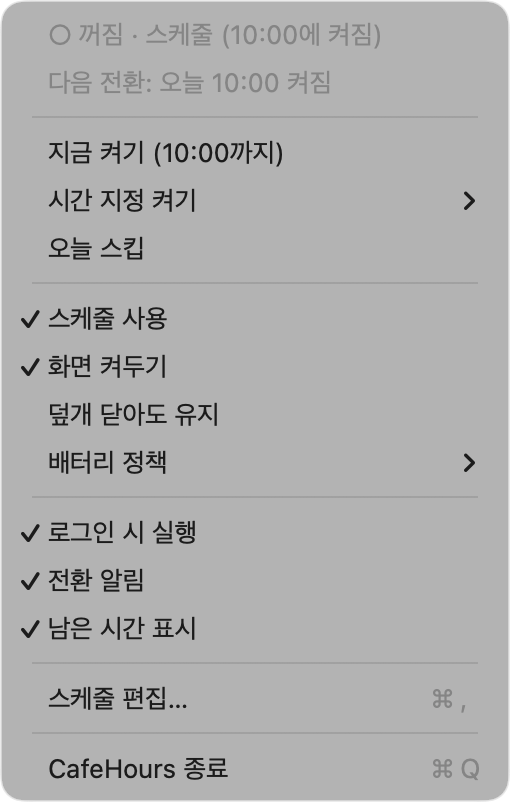
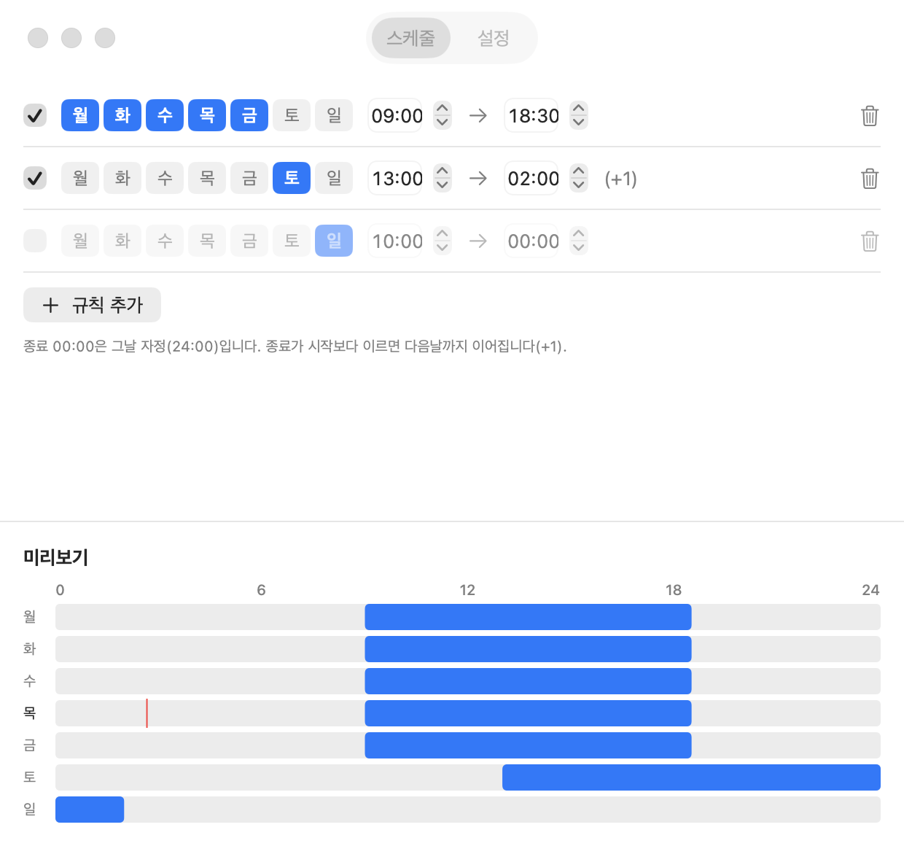
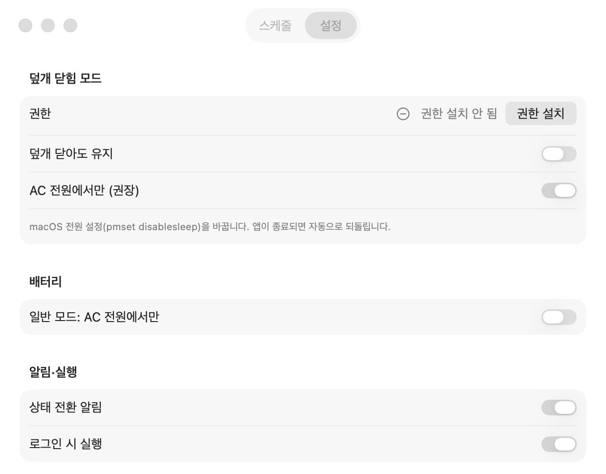

# CafeHours

macOS 26 메뉴바 앱. 요일별 스케줄에 따라 화면 덮개를 닫아도 잠들지 않는 "덮개 모드"를 자동으로 켜고 끕니다.
0.2.0부터는 Claude Code·Cowork 같은 코딩 에이전트가 작업 중인 동안 맥을 깨워 두고, 명령줄 도구 `cafehours`로 제어할 수 있습니다.

| 메뉴바 | 스케줄 | 설정 |
|---|---|---|
|  |  |  |

## 설치

```
brew tap rogiry/CafeHours
brew trust --tap rogiry/cafehours
brew install --cask cafehours
xattr -dr com.apple.quarantine /Applications/CafeHours.app  # Gatekeeper 경고 없이 바로 열려면(선택)
```

## 에이전트 대기와 명령줄 도구 (0.2.0부터)

- 메뉴 **에이전트 작업이 끝날 때까지 켜기**: 에이전트가 모두 idle이 되고 3분이 지나면 스스로 풉니다
- **에이전트 ▸ 스케줄 종료 시 에이전트 작업이 끝날 때까지 유지**: 영업 종료 시각에 에이전트가 바쁘면 꺼짐을 미룹니다(기본 꺼짐)
- Claude Code 세션은 설정 탭 **에이전트 · 명령줄 > Claude Code 훅 > 설치**(또는 `cafehours hooks install`)로 정확하게 잡힙니다. `~/.claude/settings.json`에 CafeHours 항목만 더하고 원본을 백업하며 다른 도구의 훅은 그대로 둡니다. 훅이 없어도 트랜스크립트 갱신으로 추정합니다

cask가 `cafehours`를 `$(brew --prefix)/bin`에 연결합니다.

```
cafehours status                 # 현재 상태와 에이전트 요약 (--json)
cafehours on --until-idle        # 에이전트 작업이 끝날 때까지 켜기
cafehours wait --idle --timeout 2h && ./deploy.sh   # 다른 에이전트가 모두 끝나면 (자기 세션은 제외)
cafehours agent busy --id build --ttl 30m           # 스크립트 작업을 등록 (끝나면 agent idle --id build)
cafehours doctor                 # 설치·연결 진단
```

## 업데이트

```
brew upgrade --cask cafehours
cafehours version; cafehours doctor    # 0.2.0부터: 연결 확인 (훅을 설치하지 않았으면 훅 항목만 ✗)
```

## 제거

덮개 모드를 쓰고 있었다면 먼저 CafeHours 메뉴에서 꺼서 `/etc/sudoers.d/cafehours`를 정리한 뒤 지우세요.
Claude Code 훅을 설치했다면 `cafehours hooks uninstall`로 먼저 제거하세요(지운 뒤 남은 훅은 아무것도 하지 않고 조용히 끝납니다).

```
brew uninstall --zap --cask cafehours
```

## 참고

- 개인 배포용 ad-hoc 서명 앱입니다(Developer ID 서명·공증 없음). 위 `xattr` 줄을 건너뛰었는데 Gatekeeper가 막으면 시스템 설정 > 개인정보 보호 및 보안에서 "그래도 열기"를 눌러주세요.
- macOS 26 이상 필요.
- 덮개 모드를 켜면 관리자 인증과 함께 sudoers 드롭인이 설치됩니다.
